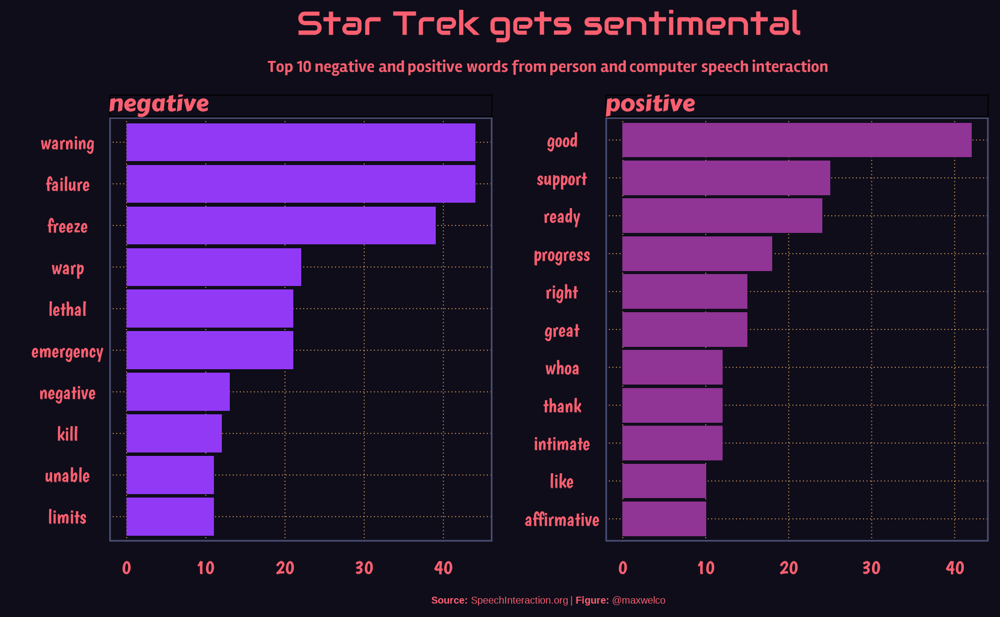
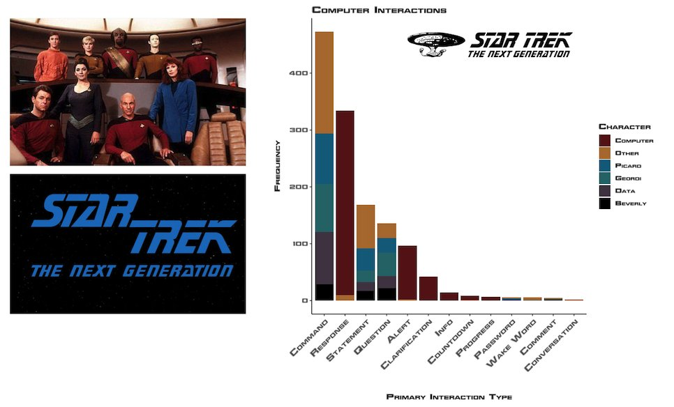
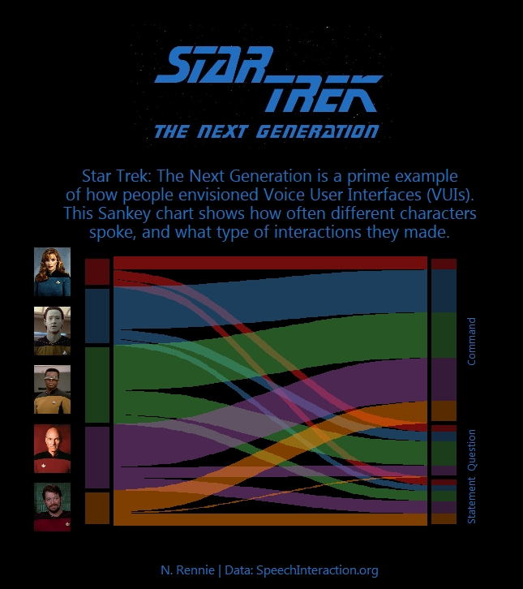
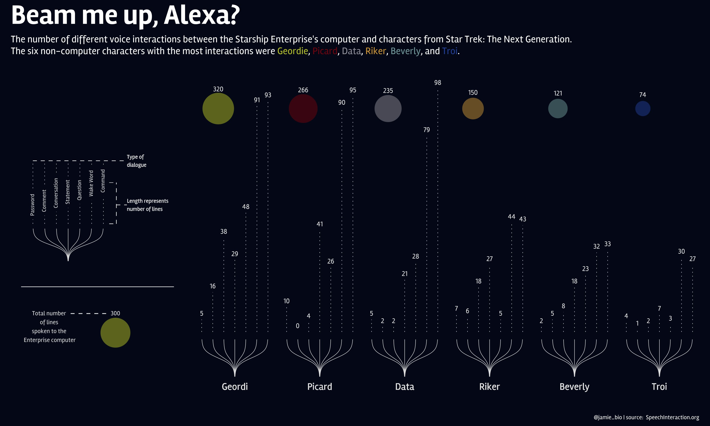
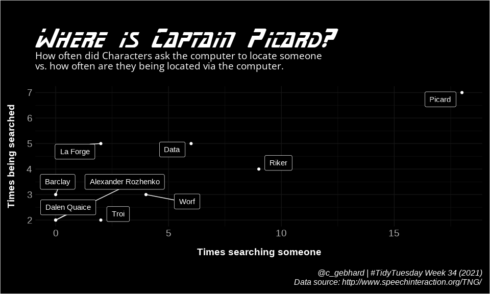
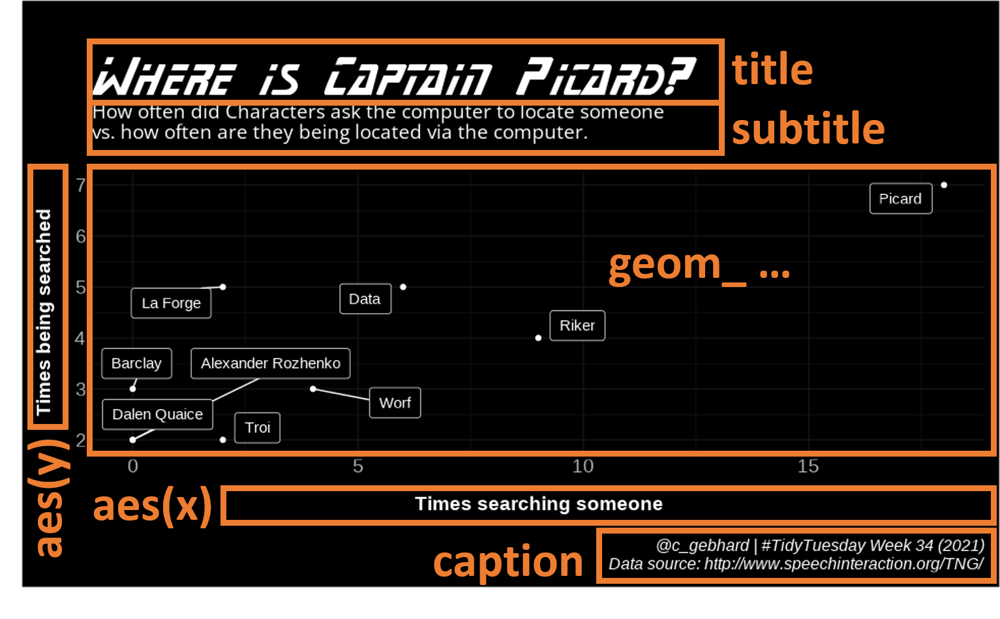
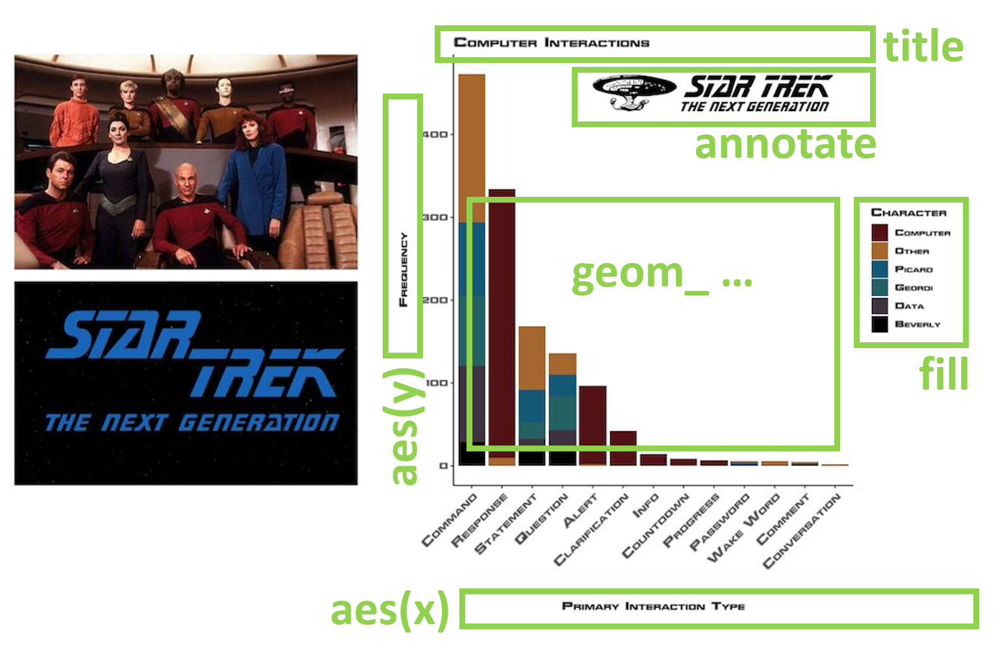

```{r setup, include=FALSE}
options(htmltools.dir.version = FALSE)

knitr::opts_chunk$set(message = FALSE, warning = FALSE, comment = "", cache = FALSE, echo = FALSE, fig.retina = 3)

options(warnPartialMatchDollar = FALSE)


library(tidyverse)
library(patchwork)
library(knitr)
library(kableExtra)
library(twang)
library(survey)
library(ggmosaic)

# 95% CI, s sided
z <- qnorm(1 - 0.025)

my_base_size <- 14

```

```{r xaringan-themer, include=FALSE, warning=FALSE}
library(xaringanthemer)
style_mono_accent(
  base_color = "#663366",
  header_font_google = google_font("Roboto"),
  text_font_google   = google_font("Roboto", "300", "300i"),
  code_font_google   = google_font("Roboto Mono")
)
```

```{r xaringanExtra, echo=FALSE}

xaringanExtra::use_tile_view()

xaringanExtra::use_logo(
  image_url = "logo.png",
  width = "70px")

xaringanExtra::use_extra_styles(
  hover_code_line = TRUE,         #<<
  mute_unhighlighted_code = TRUE  #<<
)

xaringanExtra::use_webcam()

xaringanExtra::use_panelset()


```

## Wat gaan we doen

*  Korte presentatie: Tidy Tuesday
*  Compacte uitleg: (gg)plots in R
*  Zelf: aan de slag met een dataset


---

## Tidy Tuesday

```{r, fig.width = 3, fig.alt="Logo TidyTuesday, a weekly data project in R from the R4DS online learning community"}
knitr::include_graphics("tidytuesday/tidytuesday_logo.png")
```

```{r, cache=  TRUE}
raw_url <- "https://raw.githubusercontent.com/rfordatascience/tidytuesday/master/tidytuesday_tweets/data.csv"

raw_df <- read_csv(raw_url)


aantal_tweets <- raw_df %>% distinct(status_id) %>% nrow()
aantal_personen <- raw_df %>% distinct(screen_name) %>% nrow()


```


*  Sinds 1 april 2018
*  "safe and supportive forum for individuals to practice their wrangling and data visualization skills independent of drawing conclusions"
*  Elke week een ruwe dataset en artikel
*  Exploreer de data en visualiseer
*  Deel plaatje en code
*  `r aantal_tweets` tweets door `r aantal_personen` personen
*  Lees meer op: https://github.com/rfordatascience/tidytuesday
*  en #tidytuesday op twitter

---

## Voorbeeld Tidy Tuesday

* 17 augustus 2021
* Voice Interaction Computer Star Trek
* Data set met 2214 regels en 14 kolommen

---

## TT Voice Interaction Computer Star Trek 1/2

```{r}
readxl::read_xlsx(here::here("tidytuesday", "computer.xlsx")) %>% kable()
```

---

## TT Voice Interaction Computer Star Trek 2/2

.panelset[
.panel[.panel-name[Oliveira]
```{r, out.width= "60%"}

```

https://twitter.com/maxwelco/status/1428771293642608643

]
.panel[.panel-name[Eilerts]
```{r, out.width= "60%"}

```

https://twitter.com/DianeEilerts/status/1427847269127131138

]
.panel[.panel-name[Rennie]
```{r, out.width= "30%"}

```

https://twitter.com/nrennie35/status/1430183369304940549

]
.panel[.panel-name[Hudson]
```{r, out.width= "60%"}

```

https://twitter.com/Jamie_Bio/status/1428494523487952897

]
.panel[.panel-name[Gephard]
```{r, out.width= "60%"}

```

https://twitter.com/c_gebhard/status/1429909416346804226

]


]

---

## `ggplot`'s anatomie  

.panelset[
.panel[.panel-name[Gebhard met annotatie]
```{r, out.width= "70%"}

```

]
.panel[.panel-name[mogelijke code ]

```{r, echo = TRUE, eval = FALSE}
ggplot(data = dStartrek,
       aes(x = searching,
           y = searched)) +
   geom_label_repel(aes(label = char)) +
   labs( title = "Where is Captain Picard?",
         subtitle = "How often did...",
         x = "Times searching someone",
         y = "Times being searched",
         caption = "@c_gebhard ...")
```

]

.panel[.panel-name[Eilerts met annotatie]
```{r, out.width= "60%"}

```

]
.panel[.panel-name[mogelijke code ]

```{r, echo = TRUE, eval = FALSE}
library(trekfont)   # Star Trek fonts
library(rtrek)      # datasets Star Trek Universe
library(patchwork)  # plots combineren

pMain <- ggplot(data = dStartrek,
                aes(x = interaction_type,
                    fill = char)) +
   geom_bar()) +
   labs( title = "Computer Interactions",
         x = "Primary Interaction Type",
         y = "Frequency",
         fill = "Character") +
   annotate("text", x = 5, y= 450, label = "NX", family = "TNGcast")

pLB <- ma_image(...)
pLO <- ma_image(...)

(plB / pLO) + pMain
```

]

]

---

## Verschillende soorten visualisaties in R

https://www.r-graph-gallery.com/

---

## De data die wij gaan visualiseren

*  Afkomstig van DUO
*  107522 regels met 17 variabelen
*  per vo-school, per jaar, en per profiel:
  *  het aantal examenkandidaten
  *  het aantal geslaagden
  *  het aantal gezakten
  *  gemiddeld cijfer op lijst
  *  gemiddeld cijfer schoolexamen
  *  gemiddeld cijfer centraal examen

---

## Aan de slag

*  Ga naar https://github.com/MMJansen/DAIR2021
*  Klik op de groen knop "Code", en kies Download Zip
*  Unzip het bestand

De volgende stappen veronderstellen de aanwezigheid van R en RStudio:

*  Vanuit de verkenner, dubbelklik `DAIRpres.Rproj`
*  Vanuit het files overzicht rechtsonder in RStudio, dubbelklik `Geslaagden.Rmd`


